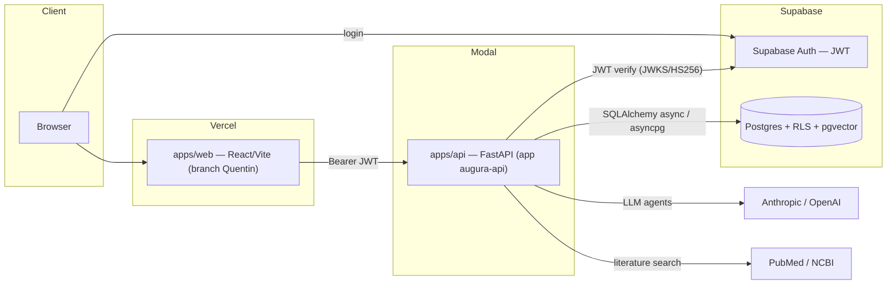
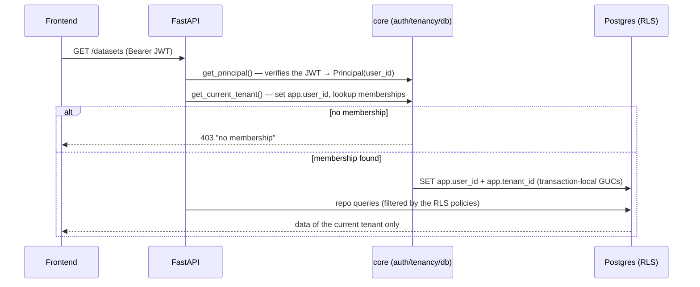
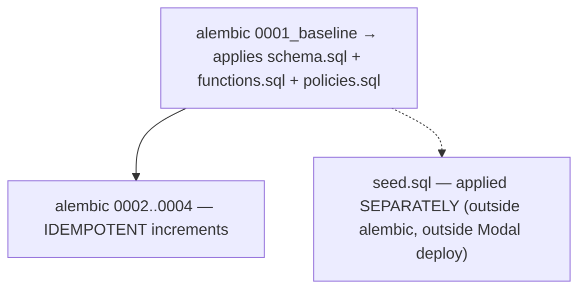
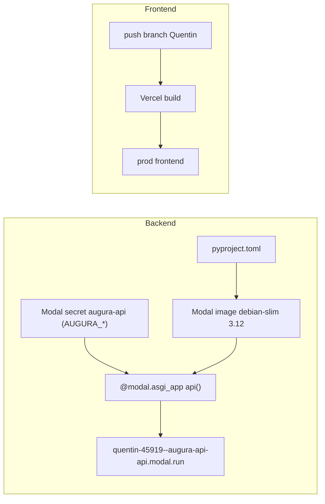

# Augura — System architecture (DESIGN.md)

Architecture document for the Augura platform. For repo commands and conventions, see [CLAUDE.md](CLAUDE.md). Reference specs: `docs/specs/2026-06-11-augura-backend-architecture-design.md` and `docs/specs/2026-06-13-delivery-design.md`.

## 1. Overview

Augura is a **clinical study design** platform: literature search, data ingestion/quality, semantic layer (taxonomy + causal ontology), causal modeling (DAG), regulatory simulation, and dossier generation.

Structuring choice: **modular monolith**. A single FastAPI service, split into strongly isolated vertical modules (contracts verified by `import-linter`), rather than a constellation of microservices. We gain the deployment simplicity of a monolith while keeping clean internal boundaries that would allow a later extraction.

Guiding principles:
- **Multi-tenant by default**: data isolation via Postgres RLS, defense in depth (the code scopes *and* the database scopes).
- **Fail-fast**: any missing required config fails the boot (`core/config.py`).
- **Real only**: no mocked data on the frontend nor fabricated fallbacks — everything goes through the API.
- **Typed contract end to end**: the backend's OpenAPI generates the TS client (`packages/api-client`), drift-checked in CI.

## 2. Topology



- The **frontend** (Vercel) authenticates the user via Supabase Auth, retrieves a JWT, and calls the **API** (Modal) with `Authorization: Bearer`.
- The **API** verifies the JWT (JWKS RS256 or HS256 secret), resolves the tenant, then talks to **Postgres** under RLS context.
- Prod backend: `https://quentin-45919--augura-api-api.modal.run`. Prod DB: Supabase project `Augura_Prod` (`fqmoylmvjoafihiuiiuj`).

## 3. Backend — modular monolith

### 3.1 Layers

```
apps/api/src/augura_api/
  main.py            # create_app(): mounts middlewares + all routers
  core/              # cross-cutting, INDEPENDENT of the modules
    auth.py          # Supabase JWT → Principal(user_id, email)
    tenancy.py       # resolve_tenant(): Principal + memberships lookup → CurrentTenant
    deps.py          # CurrentTenantDep, SessionDep, require_role()
    db.py            # sessionmaker + RLS GUCs (set_user_stmt / set_tenant_stmt)
    config.py        # Settings (env AUGURA_*), fail-fast
    errors.py        # exceptions → normalized HTTP responses
    logging.py       # structlog + RequestIdMiddleware
    storage.py       # generated artifacts (local in dev, bucket/volume in prod)
    llm/             # Anthropic/OpenAI clients
  modules/<name>/    # vertical slices (see 3.3)
```

`import-linter` contracts (in `pyproject.toml`, verified by `uv run lint-imports`):
- `core` **never** imports `modules` nor `jobs` (the foundation does not depend on features).
- The data modules (`studies`, `corpus`, `datasets`) are **mutually independent**. `agents` is the orchestration layer: it may consume the public interface of `corpus`.

### 3.2 Request lifecycle



The tenant **is not in the token**: it is resolved on each request via the `memberships` table. This lets a user belong to several orgs without reissuing a JWT, and keeps the membership authority on the DB side.

### 3.3 Module catalog

| Module | Responsibility | Notes |
|---|---|---|
| `studies` | Clinical studies (root entity) | canonical vertical slice |
| `corpus` | Literature search (retrieve-and-freeze) | snapshots frozen by `content_hash`; PubMed/NCBI |
| `datasets` | Datasets / upload / cohorts | upload without role gating |
| `dq` | Data quality (constraints, bundles) | |
| `mapping` | Mapping variables to the taxonomy | |
| `documents` | Document/dossier generation | builds on `jobs` |
| `simulation` | Regulatory simulation (power, bias) | ICH E9 / HAS / DiGA thresholds |
| `analytics` | Analytics & admin | **`require_role("owner")`** |
| `reference` | Reference catalogs (CESL, estimators) | seeded |
| `jobs` | Cross-cutting queue | module-level functions (`create_job`/`get_job`), no service class |
| `agents` | LLM orchestration | no `repo`/`models`; reads `corpus`; `service`+`streaming`+`tools` |
| `semantic` (B1) | Taxonomy + causal ontology | `GET /semantic/concepts`, `GET /semantic/relations` |
| `causal` (B2) | Causal DAG generation | `POST /causal/dag` — ontology subgraph + LLM contextualization |

### 3.4 Semantic (B1) & causal (B2) layer

- **B1 / `semantic`**: flat clinical taxonomy (`taxonomy_concepts`, synonyms, units, valid values, standard codes, therapeutic areas) **+ causal ontology** (`causal_predicates`, `ontology_relations`, `ontology_relation_evidence`, `ontology_relation_qualifiers`). All read-only (RLS `backend_read`), populated by `seed.sql`. Exposed by `GET /semantic/relations`.
- **B2 / `causal`**: `POST /causal/dag` extracts a relevant **subgraph** from the B1 ontology (`subgraph.py`) then **contextualizes it via an Anthropic agent** (`builder.py`/`prompt.py`) to produce a DAG `{nodes, edges, adjustment_set, collider_ids, rationale}`. The LLM does not invent the structure; it relies on the stored ontology.

## 4. Data & multi-tenancy

### 4.1 Tenant model

- `orgs(id, name, slug unique, cesl_profile, …)` and `memberships(org_id, user_id, role ∈ {owner,member,viewer}, unique(org_id,user_id))`.
- `memberships.user_id` = `auth.users.id` (= JWT `sub`), **without a hard FK** to `auth.users` (by design: auth lives on the Supabase side).
- RLS: transaction-local GUCs `app.user_id` ("member_self" policy on `memberships`) and `app.tenant_id` (tenant isolation of the business tables).

### 4.2 The SQL bundle

`apps/api/supabase/`:
- `schema.sql` — tables & indexes (schema authority).
- `functions.sql` — SQL functions.
- `policies.sql` — RLS enablement + policies (tenant isolation + read of the global catalogs).
- `seed.sql` — reference catalogs (taxonomy, ontology, CESL). **No demo data.**

### 4.3 Migration strategy



Key invariant: **every migration `0002+` must be idempotent** (`CREATE … IF NOT EXISTS`, `DROP … IF EXISTS`), because the baseline reapplies `schema.sql`. The `db-bundle` CI replays the whole bundle on a fresh Postgres+pgvector and verifies schema + seed + RLS isolation.

## 5. Frontend

- **React 19 + Vite + Tailwind 4 + radix-ui + react-router 7** (Vercel build/deployment).
- `src/shell/sections.js`: **single source** of the top-level navigation (Studies, Data, Literature, Variables & Models, Causal modeling, Semantic layer, Audit, Dossiers), rendered by `WorkspaceNav.jsx`.
- `src/workspace/*`: top-level pages (`DatasetsPage`, `SemanticLayerPage`, `CausalModelingPage`, …).
- `src/LucisApp.jsx`: per-study workspace (`/studies/:id/*`).
- `src/api.js`: a single HTTP entry point, adds the `Bearer <JWT>` to every call; base = `VITE_API_URL` otherwise falls back to the prod Modal backend. `src/supabase.js`: auth client.
- Types consumed from `packages/api-client` (generated from the OpenAPI).

## 6. Authentication & security

- **Auth**: Supabase Auth issues the JWT; the API verifies it (JWKS RS256 or HS256 secret depending on the project). `Principal` = `{user_id = sub, email}`.
- **Authorization**: membership required for any tenant route; `require_role("owner")` for sensitive routes (analytics/admin).
- **Isolation**: Postgres RLS as defense in depth — even if the code forgot a filter, the policies bound the rows to the current tenant.
- **CORS**: explicit list + regex (Vercel previews); **fail-fast** if not configured in prod (`allow_credentials=True` forbids the wildcard).

## 7. Deployment & environments



- **Backend (Modal)**: `bash apps/api/scripts/deploy_modal.sh` recreates the `augura-api` secret from `.env`, builds the image from `pyproject.toml` (single source of truth for deps), and deploys the ASGI app. **Runs neither migrations nor seed** — the DB is managed separately.
- **Frontend (Vercel)**: triggered by the push of the deployed branch (`Quentin`).
- **DB (Supabase)**: privileged operations via the SQL editor / Supabase MCP (the `.env` only carries the application role `augura_api`).
- **CI** (`.github/workflows/ci.yml`): `api` job (`ruff format --check`, `ruff check`, `pyright`, `lint-imports`, `pytest`) + `db-bundle` job (SQL bundle on a real Postgres+pgvector) + drift-check of the OpenAPI client.

## 8. Invariants & decisions

1. **Migrations `0002+` idempotent**; `seed.sql` applied separately.
2. **`core` independent of `modules`/`jobs`**; data modules mutually independent (import-linter).
3. **Real only** on the frontend (zero mock/fallback).
4. **Fail-fast config**; missing LLM keys ⇒ explicit `503`, not an opaque failure.
5. **OpenAPI = contract**; `schema.d.ts` never edited by hand.

## 9. Known limits & roadmap

- **Org/membership bootstrap**: no code creates an org/membership automatically → a new account without a membership is blocked (403). Manual provisioning currently; auto-bootstrap (shared org vs personal org) to be decided then implemented (`SECURITY DEFINER` function called in `get_current_tenant`).
- **Privacy / Validation / Lineage tabs** (dataset detail): placeholders, no backend.
- **Heterogeneous DI**: `simulation`/`documents`/`analytics` still inject the `session` and rebuild the repo per method; to be aligned on the `XService(XRepo(session))` form on the next pass.
- **Taxonomy/ontology parity**: progressive enrichment once the data path is proven by the seed.

## 10. References

- `CLAUDE.md` — commands, env, conventions, operational gotchas.
- `apps/api/src/augura_api/modules/README.md` — module split convention.
- `docs/specs/2026-06-11-augura-backend-architecture-design.md` — backend architecture spec.
- `docs/specs/2026-06-13-delivery-design.md` — delivery design.
