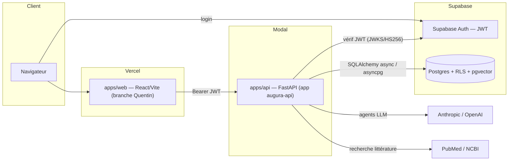
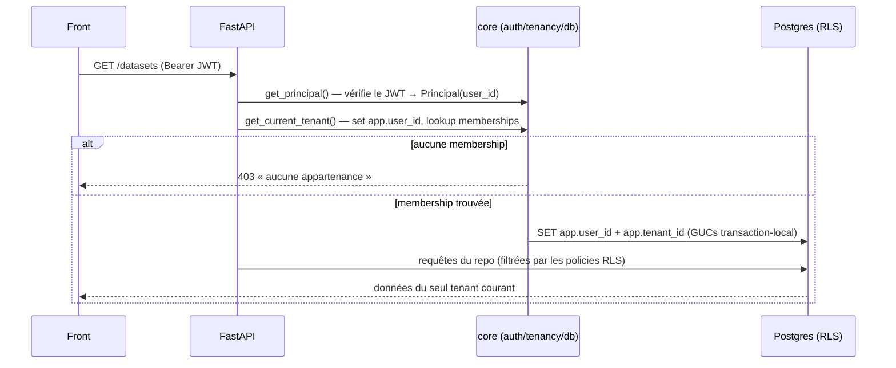
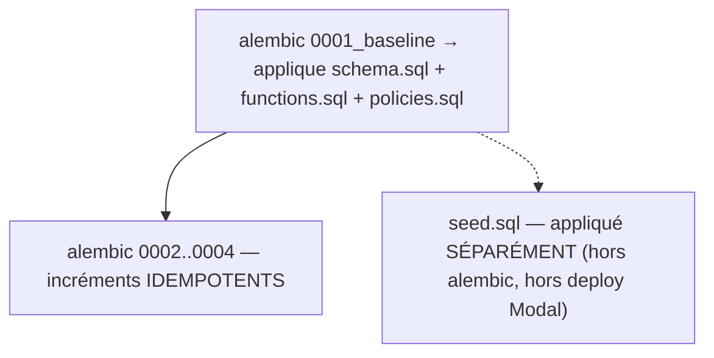
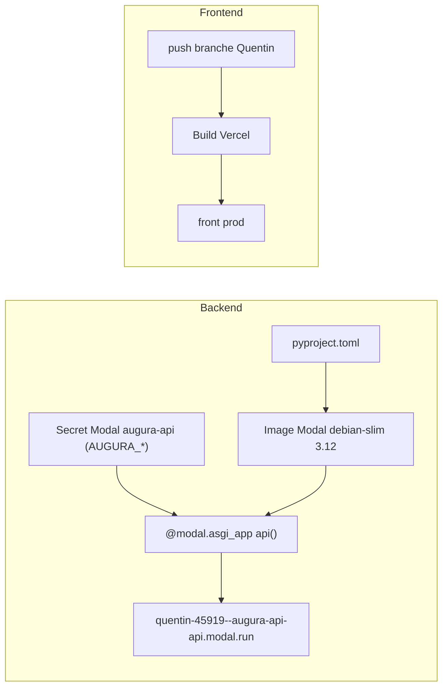

# Augura — Architecture système (DESIGN.md)

Document d'architecture de la plateforme Augura. Pour les commandes et conventions du dépôt, voir [CLAUDE.md](CLAUDE.md). Spécifications de référence : `docs/specs/2026-06-11-augura-backend-architecture-design.md` et `docs/specs/2026-06-13-delivery-design.md`.

## 1. Vue d'ensemble

Augura est une plateforme de **conception d'études cliniques** : recherche de littérature, ingestion/qualité des données, couche sémantique (taxonomie + ontologie causale), modélisation causale (DAG), simulation réglementaire, et génération de dossiers.

Choix structurant : **monolithe modulaire**. Un seul service FastAPI, découpé en modules verticaux fortement isolés (contrats vérifiés par `import-linter`), plutôt qu'une constellation de microservices. On gagne la simplicité de déploiement d'un monolithe tout en gardant des frontières internes nettes qui autoriseraient une extraction ultérieure.

Principes directeurs :
- **Multi-tenant par défaut** : isolation des données via RLS Postgres, défense en profondeur (le code scope *et* la base scope).
- **Fail-fast** : toute config requise manquante fait échouer le boot (`core/config.py`).
- **Réel uniquement** : pas de données mockées côté front ni de fallbacks fabriqués — tout transite par l'API.
- **Contrat typé de bout en bout** : l'OpenAPI du backend génère le client TS (`packages/api-client`), drift-checké en CI.

## 2. Topologie



- Le **front** (Vercel) authentifie l'utilisateur via Supabase Auth, récupère un JWT, et appelle l'**API** (Modal) en `Authorization: Bearer`.
- L'**API** vérifie le JWT (JWKS RS256 ou secret HS256), résout le tenant, puis parle à **Postgres** sous contexte RLS.
- Prod backend : `https://quentin-45919--augura-api-api.modal.run`. Prod DB : projet Supabase `Augura_Prod` (`fqmoylmvjoafihiuiiuj`).

## 3. Backend — monolithe modulaire

### 3.1 Couches

```
apps/api/src/augura_api/
  main.py            # create_app() : monte middlewares + tous les routers
  core/              # transverse, INDÉPENDANT des modules
    auth.py          # JWT Supabase → Principal(user_id, email)
    tenancy.py       # resolve_tenant() : Principal + lookup memberships → CurrentTenant
    deps.py          # CurrentTenantDep, SessionDep, require_role()
    db.py            # sessionmaker + GUCs RLS (set_user_stmt / set_tenant_stmt)
    config.py        # Settings (env AUGURA_*), fail-fast
    errors.py        # exceptions → réponses HTTP normalisées
    logging.py       # structlog + RequestIdMiddleware
    storage.py       # artefacts générés (local en dev, bucket/volume en prod)
    llm/             # clients Anthropic/OpenAI
  modules/<nom>/     # tranches verticales (voir 3.3)
```

Contrats `import-linter` (dans `pyproject.toml`, vérifiés par `uv run lint-imports`) :
- `core` n'importe **jamais** `modules` ni `jobs` (le socle ne dépend pas des features).
- Les modules de données (`studies`, `corpus`, `datasets`) sont **mutuellement indépendants**. `agents` est la couche d'orchestration : il peut consommer l'interface publique de `corpus`.

### 3.2 Cycle de vie d'une requête



Le tenant **n'est pas dans le token** : il est résolu à chaque requête via la table `memberships`. Cela permet à un utilisateur d'appartenir à plusieurs orgs sans réémettre de JWT, et garde l'autorité d'appartenance côté DB.

### 3.3 Catalogue des modules

| Module | Responsabilité | Notes |
|---|---|---|
| `studies` | Études cliniques (entité racine) | tranche verticale canonique |
| `corpus` | Recherche de littérature (retrieve-and-freeze) | snapshots gelés par `content_hash` ; PubMed/NCBI |
| `datasets` | Datasets / upload / cohortes | upload sans gating de rôle |
| `dq` | Qualité des données (contraintes, bundles) | |
| `mapping` | Mapping des variables vers la taxonomie | |
| `documents` | Génération de documents/dossiers | s'appuie sur `jobs` |
| `simulation` | Simulation réglementaire (puissance, biais) | seuils ICH E9 / HAS / DiGA |
| `analytics` | Analytique & admin | **`require_role("owner")`** |
| `reference` | Catalogues de référence (CESL, estimateurs) | seedé |
| `jobs` | File d'attente transverse | fonctions module-level (`create_job`/`get_job`), pas de classe service |
| `agents` | Orchestration LLM | pas de `repo`/`models` ; lit `corpus` ; `service`+`streaming`+`tools` |
| `semantic` (B1) | Taxonomie + ontologie causale | `GET /semantic/concepts`, `GET /semantic/relations` |
| `causal` (B2) | Génération de DAG causal | `POST /causal/dag` — sous-graphe ontologie + contextualisation LLM |

### 3.4 Couche sémantique (B1) & causale (B2)

- **B1 / `semantic`** : taxonomie clinique plate (`taxonomy_concepts`, synonymes, unités, valeurs valides, codes standards, aires thérapeutiques) **+ ontologie causale** (`causal_predicates`, `ontology_relations`, `ontology_relation_evidence`, `ontology_relation_qualifiers`). Toutes en lecture seule (RLS `backend_read`), peuplées par `seed.sql`. Exposé par `GET /semantic/relations`.
- **B2 / `causal`** : `POST /causal/dag` extrait un **sous-graphe** pertinent de l'ontologie B1 (`subgraph.py`) puis le **contextualise via un agent Anthropic** (`builder.py`/`prompt.py`) pour produire un DAG `{nodes, edges, adjustment_set, collider_ids, rationale}`. Le LLM n'invente pas la structure ; il s'appuie sur l'ontologie stockée.

## 4. Données & multi-tenancy

### 4.1 Modèle tenant

- `orgs(id, name, slug unique, cesl_profile, …)` et `memberships(org_id, user_id, role ∈ {owner,member,viewer}, unique(org_id,user_id))`.
- `memberships.user_id` = `auth.users.id` (= `sub` du JWT), **sans FK dure** vers `auth.users` (par design : l'auth vit côté Supabase).
- RLS : GUCs transaction-local `app.user_id` (policy « member_self » sur `memberships`) et `app.tenant_id` (isolation tenant des tables métier).

### 4.2 Le bundle SQL

`apps/api/supabase/` :
- `schema.sql` — tables & index (autorité du schéma).
- `functions.sql` — fonctions SQL.
- `policies.sql` — activation RLS + policies (isolation tenant + lecture des catalogues globaux).
- `seed.sql` — catalogues de référence (taxonomie, ontologie, CESL). **Aucune donnée de démo.**

### 4.3 Stratégie de migration



Invariant clef : **toute migration `0002+` doit être idempotente** (`CREATE … IF NOT EXISTS`, `DROP … IF EXISTS`), parce que le baseline réapplique `schema.sql`. La CI `db-bundle` rejoue tout le bundle sur un Postgres+pgvector neuf et vérifie schéma + seed + isolation RLS.

## 5. Frontend

- **React 19 + Vite + Tailwind 4 + radix-ui + react-router 7** (build/déploiement Vercel).
- `src/shell/sections.js` : **source unique** de la navigation top-level (Studies, Data, Literature, Variables & Models, Causal modeling, Semantic layer, Audit, Dossiers), rendue par `WorkspaceNav.jsx`.
- `src/workspace/*` : pages de premier niveau (`DatasetsPage`, `SemanticLayerPage`, `CausalModelingPage`, …).
- `src/LucisApp.jsx` : workspace par étude (`/studies/:id/*`).
- `src/api.js` : un seul point d'entrée HTTP, ajoute le `Bearer <JWT>` à chaque appel ; base = `VITE_API_URL` sinon repli sur le backend Modal de prod. `src/supabase.js` : client d'auth.
- Types consommés depuis `packages/api-client` (générés depuis l'OpenAPI).

## 6. Authentification & sécurité

- **Auth** : Supabase Auth émet le JWT ; l'API le vérifie (JWKS RS256 ou secret HS256 selon le projet). `Principal` = `{user_id = sub, email}`.
- **Autorisation** : appartenance (membership) obligatoire pour toute route tenant ; `require_role("owner")` pour les routes sensibles (analytics/admin).
- **Isolation** : RLS Postgres en défense en profondeur — même si le code oubliait un filtre, les policies bornent les lignes au tenant courant.
- **CORS** : liste explicite + regex (previews Vercel) ; **fail-fast** si non configuré en prod (`allow_credentials=True` interdit le wildcard).

## 7. Déploiement & environnements



- **Backend (Modal)** : `bash apps/api/scripts/deploy_modal.sh` recrée le secret `augura-api` depuis `.env`, construit l'image depuis `pyproject.toml` (source de vérité unique des deps), et déploie l'ASGI app. **Ne lance ni migrations ni seed** — la DB se gère à part.
- **Frontend (Vercel)** : déclenché par le push de la branche déployée (`Quentin`).
- **DB (Supabase)** : opérations privilégiées via le SQL editor / MCP Supabase (le `.env` ne porte que le rôle applicatif `augura_api`).
- **CI** (`.github/workflows/ci.yml`) : job `api` (`ruff format --check`, `ruff check`, `pyright`, `lint-imports`, `pytest`) + job `db-bundle` (bundle SQL sur Postgres+pgvector réel) + drift-check de l'OpenAPI client.

## 8. Invariants & décisions

1. **Migrations `0002+` idempotentes** ; `seed.sql` appliqué séparément.
2. **`core` indépendant des `modules`/`jobs`** ; modules de données mutuellement indépendants (import-linter).
3. **Réel uniquement** côté front (zéro mock/fallback).
4. **Config fail-fast** ; clés LLM absentes ⇒ `503` explicite, pas d'échec opaque.
5. **OpenAPI = contrat** ; `schema.d.ts` jamais édité à la main.

## 9. Limites connues & feuille de route

- **Bootstrap org/membership** : aucun code ne crée d'org/membership automatiquement → un nouveau compte sans membership est bloqué (403). Provisioning manuel actuellement ; auto-bootstrap (org partagée vs org perso) à décider puis implémenter (fonction `SECURITY DEFINER` appelée dans `get_current_tenant`).
- **Onglets Privacy / Validation / Lineage** (dataset detail) : placeholders, sans backend.
- **DI hétérogène** : `simulation`/`documents`/`analytics` injectent encore la `session` et reconstruisent le repo par méthode ; à aligner sur la forme `XService(XRepo(session))` au prochain passage.
- **Parité taxonomie/ontologie** : enrichissement progressif une fois le chemin de données prouvé par le seed.

## 10. Références

- `CLAUDE.md` — commandes, env, conventions, pièges opérationnels.
- `apps/api/src/augura_api/modules/README.md` — convention de découpage des modules.
- `docs/specs/2026-06-11-augura-backend-architecture-design.md` — spec d'architecture backend.
- `docs/specs/2026-06-13-delivery-design.md` — design de livraison.
